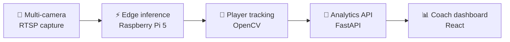

<!--
  GitHub profile README for MayankSinghRaghav
  Copy this file into the special repo:  github.com/MayankSinghRaghav/MayankSinghRaghav
  Design system: violet (#7C3AED / #A855F7) + deep blue (#4F46E5), flat-square badges, dark/light safe.
-->

<div align="center">


[](https://git.io/typing-svg)

<kbd>AI Product Manager</kbd> &nbsp; <kbd>LLM / RAG Builder</kbd> &nbsp; <kbd>Shipped AI Products</kbd>

<br/>

[](https://www.linkedin.com/in/mayanksinghraghav/)
[](https://msr-portfolio-iota.vercel.app/)
[](mailto:mayanksinghraghav2083@gmail.com)
[](https://github.com/MayankSinghRaghav)

</div>

---

## The short version

I work at the intersection of **product management and AI engineering**. I turn ambiguous problems into PRDs, working prototypes, and measurable outcomes — then stay close enough to the code to know whether the spec is actually buildable.

Most AI PMs stop at the spec. I ship the LLM pipeline, the RAG retrieval, the CV inference, and the dashboard — and then I measure whether users came back.

```text
~$ whoami
Mayank Singh Raghav — AI Product Manager (builder-type) · Gurugram, India

~$ cat what_i_do.txt
ambiguous problem  →  PRD + strategy  →  AI prototype  →  shipped product  →  measured outcome

~$ ls ./proof
6792_reviews_processed   +78_NPS   40%_faster_APIs   edge_AI_on_raspberry_pi_5
```

<table align="center">
<tr>
<td align="center" width="25%"><h3>6,792</h3><sub>app reviews processed<br/>end-to-end (Groww Pulsator)</sub></td>
<td align="center" width="25%"><h3>+78</h3><sub>NPS among<br/>early users</sub></td>
<td align="center" width="25%"><h3>40%</h3><sub>faster API response<br/>(Bluestock Fintech)</sub></td>
<td align="center" width="25%"><h3>Pi 5</h3><sub>multi-camera edge AI<br/>shipped to hardware</sub></td>
</tr>
</table>

---

## 🥇 Flagship — FootIQ

> **Football analytics platform** that turns multi-camera match footage into real-time player-performance intelligence, running inference at the edge instead of shipping raw video to the cloud.

**Problem** — Coaches want live performance data, but streaming raw multi-camera video off-site is slow, expensive, and a privacy liability.
**What I built** — An end-to-end pipeline: multi-camera RTSP capture → edge inference on Raspberry Pi 5 → OpenCV player tracking → FastAPI analytics → React dashboard.
**My role** — Authored the PRD, defined RTSP streaming + AV-sync specs, coordinated hardware and engineering, and drove latency fixes found through data analysis.
**Impact** — Low-latency live match analysis with **no raw-video egress** — an AI product owned from spec through hardware deployment.



`Python` · `OpenCV` · `FastAPI` · `React` · `Edge / Raspberry Pi 5` · `RTSP`  &nbsp;—&nbsp; [**Repository →**](https://github.com/MayankSinghRaghav/footiq)

---

## Selected work

<table>
<tr>
<td width="50%" valign="top">

### 📊 Groww Pulsator
**LLM app-review analytics** — deployed

Ingests thousands of app-store reviews and returns PM-ready themes, sentiment clusters, and feature requests.

**Role:** hypothesis → build → deploy → measure
**Stack:** `Python` `LangChain` `GPT-4` `Streamlit` `PostgreSQL`
**Impact:** **6,792 reviews** processed · **NPS +78**

[Repository →](https://github.com/MayankSinghRaghav/groww-pulsator)

</td>
<td width="50%" valign="top">

### 🏦 Mutual Fund FAQ Chatbot
**RAG financial assistant** — deployed

Document-grounded answers over mutual-fund docs, re-architected mid-build for free-tier infra under time pressure.

**Role:** owned the full RAG pipeline + PII filtering
**Stack:** `Next.js` `FastAPI` `Groq` `Vector DB`
**Impact:** hallucination-resistant, document-scoped answers

[Repository →](https://github.com/MayankSinghRaghav/mf-faq-chatbot)

</td>
</tr>
<tr>
<td width="50%" valign="top">

### 🎮 GameSense AI
**In-game strategy copilot** — full PRD

Real-time, context-aware strategy suggestions, taken from market sizing through GTM.

**Role:** PM lead — PRD, personas, prioritization, GTM
**Stack:** `React` `TypeScript` `RAG + LLM`
**Impact:** **$4.7B** TAM · 3 JTBD personas · 4-phase GTM

[Repository →](https://github.com/MayankSinghRaghav/gamesense-ai)

</td>
<td width="50%" valign="top">

### 🧪 Also built
**Four AI products, shipped end-to-end**

- **Zomato AI Recommender** — LLM restaurant discovery
- **HealthGuard** — Vision Transformer health monitoring
- **TalentScout** — GPT talent-matching pipeline
- **Trend Predictor** — **+12%** forecast accuracy (Prophet)

Aggregate: **30% latency reduction** across pipelines.

[GitHub →](https://github.com/MayankSinghRaghav)

</td>
</tr>
</table>

---

## Experience

**Product & Technical Lead** — *WCO Global / Elle Global* · Football analytics
<sub>Aug 2025 – May 2026</sub>
Owned the PRD-through-deployment lifecycle of a multi-camera analytics system. Defined RTSP streaming + AV-sync specs, coordinated hardware and engineering to ship on **Raspberry Pi 5** edge devices, and drove reliability fixes by locating latency bottlenecks in the data.

**Software Developer Intern (PM-adjacent)** — *Bluestock Fintech* · Fintech
<sub>May – Jun 2025</sub>
Mapped the IPO-data customer journey and prioritized API requirements with stakeholders — delivering **40% faster response times**. Built PostgreSQL + Matplotlib insight dashboards for end users.

**Associate Project Manager Intern** — *Excelerate* · Early-stage startup
<sub>Jan – Feb 2025</sub>
Ran a **6-member cross-functional team** on full Agile/Scrum. Owned the JIRA backlog end-to-end and hit **100% on-time delivery** across all sprint commitments.

**AI Product Intern** — *CodeCore Global* · AI / rural tech
<sub>Sep – Dec 2024</sub>
Led customer discovery for rural information access (schemes, subsidies), then defined and shipped a **fine-tuned DialoGPT** agriculture chatbot — with **perplexity-based** success metrics to measure output quality in production.

---

## What I build with

**AI & LLM** &nbsp;·&nbsp; LLM APIs (GPT-4 · Claude · Gemini) · RAG · LangChain · vector DBs (Pinecone / Chroma) · prompt & eval design · OpenCV

**Product & Data** &nbsp;·&nbsp; PRDs · roadmapping · MoSCoW / prioritization · market sizing · analytics (SQL · Matplotlib) · experimentation · Agile / Scrum

**Engineering** &nbsp;·&nbsp; Python · FastAPI · React / Next.js · TypeScript · PostgreSQL · Docker

<div align="center">

[](https://skillicons.dev)

</div>

---

## GitHub activity

<div align="center">


<picture>
  <source media="(prefers-color-scheme: dark)" srcset="https://raw.githubusercontent.com/MayankSinghRaghav/MayankSinghRaghav/output/github-contribution-grid-snake-dark.svg">
  <source media="(prefers-color-scheme: light)" srcset="https://raw.githubusercontent.com/MayankSinghRaghav/MayankSinghRaghav/output/github-contribution-grid-snake.svg">
  
</picture>

</div>

---

## Now

<table>
<tr>
<td valign="top" width="33%">

**🔨 Building**
FootIQ v2 — expanded analytics + live dashboard, and deployed, measurable AI products.

</td>
<td valign="top" width="33%">

**🧪 Exploring**
Agentic workflows (LangGraph), LLM evaluation frameworks, and multimodal AI applications.

</td>
<td valign="top" width="33%">

**🎯 Looking for**
**AI PM · APM · Product Analyst** at early-stage AI startups & product companies.
Available now · Gurugram / remote.

</td>
</tr>
</table>

<sub>Also: NextLeap PM Fellow · B.Tech CS, Amity University (2019–2023) · published AI product teardowns (VocalLabs · BlinkMoney · Reddit · Make.com) · 5+ PRDs in the artifact library.</sub>

---

<div align="center">

### Have an interesting AI product problem? Let's talk.

[](https://www.linkedin.com/in/mayanksinghraghav/)
[](mailto:mayanksinghraghav2083@gmail.com)
[](https://msr-portfolio-iota.vercel.app/)

<sub><i>The best AI PMs can build — and the best builders think like PMs.</i></sub>

</div>
