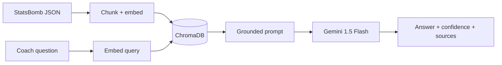

 

 

**[Portfolio](https://msr-portfolio-iota.vercel.app/)** · **[LinkedIn](https://www.linkedin.com/in/mayanksinghraghav/)** · **[Email](mailto:mayanksinghraghav2083@gmail.com)** · 📍 Gurugram / Bengaluru · **Open to AI PM · APM · Product roles**

---

## The short version

I work at the intersection of product management and AI engineering. I take ambiguous problems, turn them into requirements, build the prototype myself, deploy it, and then measure whether it actually worked.

That last part is the differentiator. Most PM portfolios stop at the PRD. Mine has running URLs.

**Where the evidence is:**

| Proof | What it was |
|---|---|
| **6,792 reviews** | End-to-end LLM pipeline clustering Groww app-store feedback into product themes — deployed |
| **Multi-camera edge AI** | Authored specs for RTSP/AV-sync pipeline, shipped on Raspberry Pi 5 hardware at WCO Global |
| **40% faster APIs** | Customer-journey mapping → API prioritization on IPO data flows at Bluestock Fintech |
| **6-person team, 100% on-time** | Full Agile ownership at Excelerate — backlog, sprints, OKRs |

---

## Featured work

### 🥇 Groww PulseAI — turning 6,792 reviews into a product roadmap

> **Problem.** Product teams sit on thousands of app-store reviews and read maybe forty of them. The signal exists; nobody has time to extract it.

> **What I built.** An LLM pipeline that ingests reviews at scale, clusters them into product themes, and emits PM-ready summaries — the artifact a team can actually take into a prioritization meeting.

> **My role.** Everything: problem framing, pipeline design, prompt and eval design, build, deploy.

**Stack** `Python` · `LangChain` · `LLM APIs` · `Streamlit` · `PostgreSQL`

**Outcome** 6,792 reviews processed end-to-end · +78 simulated NPS in design validation · manual analysis cut from hours to minutes

**[→ Live app](https://groww-pulse-ai.vercel.app)**

 

### ⚽ FootIQ — grounded tactical Q&A over real match data

> **Problem.** Match-event data (StatsBomb JSON) holds the answers coaches want, but querying it means writing code. And an ungrounded LLM will happily invent a pass-accuracy number.

> **What I built.** A RAG system where a coach uploads a match file and asks in plain English — *"who created the most chances?"* — and gets answers sourced only from retrieved event chunks, with a confidence score. The system prompt is designed to say *"I don't have enough match data"* rather than fabricate. Optional YOLOv8 module tracks player movement from footage.

> **My role.** Solo build — architecture, RAG pipeline, backend, frontend, deployment.

**Stack** `FastAPI` · `React 19` · `LangChain` · `Gemini` · `ChromaDB` · `YOLOv8` · `Render + Vercel`

**Outcome** Working RAG pipeline with hallucination guardrails, confidence scoring from retrieval distance, and traceable sources on every answer.

**[→ Repository](https://github.com/MayankSinghRaghav/FootIQ)**

---

### Selected projects

<table>
<tr>
<td width="50%" valign="top">

**🔎 Trove**

One confident tool recommendation with reasoning, instead of a ranked list of forty.

*Problem →* "Best tools for X" lists are auto-scraped, stale, and push the decision back onto you.

*Built →* Hand-checked directory that returns a single pick, the why, and two alternatives.

*Shipped →* Launched on Product Hunt and Reddit; early feedback specifically praised the curation and the shown reasoning.

`Product Hunt launch` · `live users`

**[→ Try it](https://trove-sooty-five.vercel.app/)**

</td>
<td width="50%" valign="top">

**🏦 Mutual Fund FAQ Chatbot**

Document-grounded answers to mutual fund questions.

*Problem →* Fund documentation is dense; generic chatbots hallucinate financial facts.

*Built →* Full RAG pipeline — scraping, chunking, embeddings, retrieval, generation — with document-scoped retrieval and PII filtering.

*Constraint →* Re-architected mid-build to run entirely on free-tier infra.

`Next.js` · `FastAPI` · `Groq` · `Vector DB`

**[→ Repository](https://github.com/MayankSinghRaghav/Mutual-Fund-FAQ-Chatbot-Groww)**

</td>
</tr>
<tr>
<td width="50%" valign="top">

**🎮 GameSense AI Copilot**

Real-time strategy assistance for players — a PM-led spec, taken to production readiness.

*Artifacts →* Full PRD, JTBD personas, user stories with acceptance criteria, MoSCoW prioritization, risk matrix, 4-phase GTM and monetization model.

*Why it's here →* This one shows the PM craft rather than the code.

`PRD` · `market sizing` · `GTM`

</td>
<td width="50%" valign="top">

**🧪 Applied AI experiments**

Smaller builds, each shipped end-to-end from user research through working product.

[Zomato AI Recommender](https://github.com/MayankSinghRaghav/Zomato-AI-Restaurant-Recommender) — LLM-reasoned restaurant discovery
[HealthGuard](https://github.com/MayankSinghRaghav/healthguard) — Vision Transformer health monitoring
[TalentScout](https://github.com/MayankSinghRaghav/talentscout-chatbot) — AI talent-matching pipeline
Trend Predictor — Prophet forecasting, +12% accuracy

</td>
</tr>
</table>

---

## Experience

**Product & Technical Lead** — WCO Global / Elle Global · *Aug 2025 – May 2026*
Multi-camera football analytics system, from PRD to edge hardware.

- Authored PRDs and wrote the specs for RTSP streaming and AV sync across the camera pipeline
- Built the software and camera setup solo; set requirements for frontend, backend, and embedded teams working independently, then integrated the pieces
- Traced latency bottlenecks through data analysis and drove the engineering fixes
- Shipped to production on Raspberry Pi 5 edge devices

 

**Software Developer Intern (product-facing)** — Bluestock Fintech · *May – Jun 2025*
IPO data flows on a digital fintech platform.

- Mapped the end-to-end customer journey and prioritized API requirements with stakeholders → **40% faster response times**
- Built financial insight dashboards in PostgreSQL and Matplotlib

 

**Associate Project Manager Intern** — Excelerate · *Jan – Feb 2025*
0→1 startup environment, cross-functional delivery.

- Ran a **6-member team** on Agile/Scrum — standups, sprint planning, retros
- Owned the JIRA backlog end-to-end: **100% on-time delivery** across all sprint commitments

 

**AI Product Intern** — CodeCore Global · *Sep – Dec 2024*
Agriculture chatbot for rural communities.

- Led customer discovery to find the high-value use cases: schemes, subsidies, rural information access
- Defined the feature set and drove design-to-QA delivery of a fine-tuned DialoGPT assistant
- Established **perplexity-based success metrics** to measure LLM output quality in production

---

## What I build with

**AI & LLM** — RAG architectures, LangChain, vector stores (ChromaDB, Pinecone), embeddings, prompt and eval design, structured outputs, agentic workflows (n8n), computer vision (OpenCV, YOLOv8), NLP

**Product & data** — PRDs, customer discovery, JTBD, prioritization (MoSCoW, RICE), Agile/Scrum, JIRA, SQL, analytics, experimentation, LLM output-quality metrics

**Engineering** — Python, TypeScript, FastAPI, React/Next.js, PostgreSQL, MongoDB, Docker, Vercel/Render

---

## Currently

**🔨 Building** — FootIQ v2, and agentic AI products with real users
**🧪 Exploring** — LLM evaluation frameworks, agentic workflow design, multimodal product applications
**🎯 Looking for** — AI PM / APM / Product roles at early-stage AI startups and mid-size product companies. Gurugram, Bengaluru, or remote. **Available now.**

---

---

### Have an AI product problem worth solving? Let's talk.

B.Tech Computer Science, Amity University (2019–2023) · NextLeap PM Fellowship

