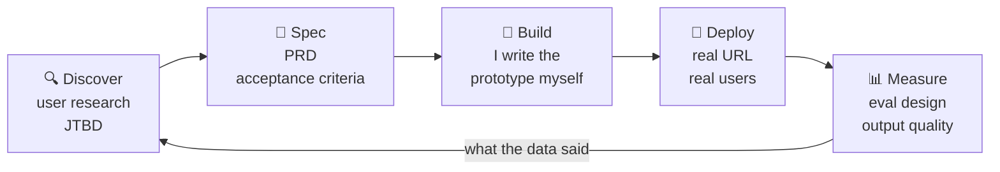
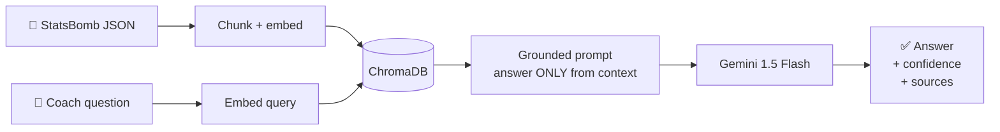

<div align="center">


[](https://git.io/typing-svg)


[](https://msr-portfolio-iota.vercel.app/)
[](https://www.linkedin.com/in/mayanksinghraghav/)
[](mailto:mayanksinghraghav2083@gmail.com)


</div>

---

<div align="center">

```
┌─────────────────────────────────────────────────────────────────┐
│  $ whoami                                                       │
├─────────────────────────────────────────────────────────────────┤
│                                                                 │
│   role         AI Product Manager · PM-engineer hybrid          │
│   thesis       The best AI PMs can build. The best builders     │
│                think like PMs. I refuse to pick one.            │
│                                                                 │
│   i own        problem discovery → PRD → prototype →            │
│                deployment → measurement                         │
│                                                                 │
│   i build with LLM pipelines · RAG · vector stores ·            │
│                computer vision · edge inference                 │
│                                                                 │
│   proof        3 deployed products · 6,792 reviews processed ·  │
│                multi-camera system live on Pi 5 hardware        │
│                                                                 │
│   status       ● available now — AI PM / APM / Product          │
│                                                                 │
└─────────────────────────────────────────────────────────────────┘
```

</div>

---

## 🧭 How I Actually Work

Most PM portfolios show you the artifact. This one shows you the loop — and every stage below has a shipped product behind it.



<div align="center">

| Stage | Where I've proven it |
|:---|:---|
| **Discover** | Customer discovery for a rural agri chatbot → surfaced schemes/subsidies as the high-value use case |
| **Spec** | PRDs for RTSP streaming + AV sync across a multi-camera pipeline at WCO Global |
| **Build** | FootIQ and Groww PulseAI — solo builds, architecture through deployment |
| **Deploy** | 3 live products, one launched publicly on Product Hunt |
| **Measure** | Perplexity-based success metrics for LLM output quality in production |

</div>

---

## 🚀 Featured Work

> Two flagships, then the supporting set. Each answers the same five questions: **Problem → Built → My Role → Stack → Outcome.**

<br/>

<div align="center">

### 🥇 Groww PulseAI
**Turning 6,792 app-store reviews into a product roadmap**

[](https://groww-pulse-ai.vercel.app)


</div>

| | |
|:---|:---|
| **Problem** | Product teams sit on thousands of app-store reviews and read maybe forty. The signal exists; nobody has the hours to extract it. |
| **What I built** | An LLM pipeline that ingests reviews at scale, clusters them into product themes, and emits PM-ready summaries — the artifact a team can walk into a prioritization meeting with. |
| **My role** | All of it: problem framing, pipeline architecture, prompt + eval design, build, deploy. |
| **Stack** | `Python` · `LangChain` · `LLM APIs` · `Streamlit` · `PostgreSQL` |
| **Outcome** | 6,792 reviews processed end-to-end · **+78 simulated NPS** in design validation · manual analysis reduced from hours to minutes |

<div align="center">

### ⚽ FootIQ
**Grounded tactical Q&A over real match data — with hallucination guardrails**

[](https://github.com/MayankSinghRaghav/FootIQ)


</div>

| | |
|:---|:---|
| **Problem** | Match-event data holds every answer a coach wants, but querying it means writing code. Worse — an ungrounded LLM will confidently invent a pass-accuracy number. |
| **What I built** | Upload a StatsBomb match file, ask in plain English — *"who created the most chances?"* — get an answer sourced **only** from retrieved event chunks, with a confidence score derived from retrieval distance. The system is designed to say *"I don't have enough match data"* rather than fabricate. An optional YOLOv8 module tracks player movement from footage. |
| **My role** | Solo build — architecture, RAG pipeline, backend, frontend, deployment. |
| **Stack** | `FastAPI` · `React 19` · `LangChain` · `Gemini` · `ChromaDB` · `YOLOv8` · `Render + Vercel` |
| **Outcome** | A working RAG system where every answer is traceable to a source chunk — the hard part of shipping LLM features anyone will trust. |



---

### 📦 Selected Projects

<details>
<summary><b>🔎 Trove — one confident recommendation instead of a ranked list</b></summary>

<br/>

> Every "best tools for X" page is auto-scraped, stale, and hands the decision straight back to you. Trove returns **one** pick, the reasoning behind it, and two alternatives.

| Attribute | Detail |
|-----------|--------|
| **Problem** | Ranked lists offload the decision onto the user — forty options is not an answer |
| **Product bet** | Does one confident answer beat a ranked list, or does it just *feel* risky until you've used it once? |
| **Built** | Hand-checked directory; every entry shows why it was picked, not just a URL |
| **Shipped** | Launched on Product Hunt and Reddit — steady upvote climb through launch day |
| **Validation** | Early feedback specifically praised the curation and the visible reasoning over auto-scraped lists |
| **Live** | [trove-sooty-five.vercel.app →](https://trove-sooty-five.vercel.app/) |

The most useful thing here isn't the build — it's that real strangers used it and told me what was wrong with the recommendations.

</details>

<details>
<summary><b>🏦 Mutual Fund FAQ Chatbot — RAG on free-tier infrastructure</b></summary>

<br/>

> Document-grounded answers to mutual fund questions — because a chatbot hallucinating financial facts is a liability, not a feature.

| Attribute | Detail |
|-----------|--------|
| **Problem** | Fund documentation is dense, and generic LLMs invent numbers when asked about it |
| **Architecture** | Scraping → chunking → embeddings → retrieval → generation |
| **Safety layer** | PII filtering · document-scoped retrieval · no external data leakage |
| **Constraint** | Re-architected mid-build to run entirely on free-tier infra (Vercel + Render) |
| **Stack** | `Next.js` · `TypeScript` · `FastAPI` · `Groq` · `Vector DB` · `Tailwind` |
| **Repository** | [View on GitHub →](https://github.com/MayankSinghRaghav/Mutual-Fund-FAQ-Chatbot-Groww) |

Built during the NextLeap PM Fellowship under real infrastructure constraints — the interesting part was deciding what to cut when the original architecture wouldn't fit the budget.

</details>

<details>
<summary><b>🎮 GameSense AI Copilot — the PM craft, start to finish</b></summary>

<br/>

> An AI copilot for real-time game strategy — taken from market sizing through GTM and monetization. This one shows the product thinking rather than the code.

| Attribute | Detail |
|-----------|--------|
| **Market** | $4.7B sizing · 3 JTBD personas |
| **PM artifacts** | Full PRD · user stories with acceptance criteria · risk matrix · GTM roadmap |
| **Prioritization** | MoSCoW framework · 4-phase GTM · monetization model |
| **Architecture** | React · TypeScript · RAG + LLM design |

The full artifact set is available on request — happy to walk through the prioritization calls and what I'd cut first.

</details>

<details>
<summary><b>🧪 Applied AI experiments — four smaller builds, shipped end-to-end</b></summary>

<br/>

| Product | Stack | What it does |
|---------|-------|--------------|
| [**Zomato AI Recommender**](https://github.com/MayankSinghRaghav/Zomato-AI-Restaurant-Recommender) | Streamlit · GPT API · Python | Restaurant discovery with LLM reasoning over preferences |
| [**HealthGuard**](https://github.com/MayankSinghRaghav/healthguard) | FastAPI · ViT · Python | Visual health monitoring via Vision Transformer |
| [**TalentScout**](https://github.com/MayankSinghRaghav/talentscout-chatbot) | FastAPI · GPT API · Python | Conversational talent-matching pipeline |
| **Trend Predictor** | Prophet · Python · Streamlit | Forecasting — **+12% accuracy improvement** |

Each started with user research and a product vision before a single line of code. Breadth across recommendation, health tech, talent, and forecasting.

</details>

---

## 💼 Experience

<table>
<tr><td>🟣</td><td>

### Product & Technical Lead — WCO Global / Elle Global
`Aug 2025 – May 2026` · Football analytics · Multi-camera edge AI

**The product:** A multi-camera football analytics system running on edge hardware.

**What I owned:** PRDs and specs for RTSP streaming and AV sync across the camera pipeline. Built the software and camera setup solo, set requirements for the frontend, backend, and embedded teams working independently, then integrated the pieces.

**Outcome:** Shipped to production on Raspberry Pi 5 edge devices. Traced latency bottlenecks through data analysis and drove the engineering fixes.


</td></tr>
<tr><td>🟣</td><td>

### Software Developer Intern (product-facing) — Bluestock Fintech
`May – Jun 2025` · Fintech · IPO data platform

**The product:** IPO data flows on a digital fintech platform.

**What I owned:** Mapped the end-to-end customer journey and prioritized API requirements with stakeholders. Built financial insight dashboards in PostgreSQL and Matplotlib.

**Outcome:** **40% faster API response times.**


</td></tr>
<tr><td>🟣</td><td>

### Associate Project Manager Intern — Excelerate
`Jan – Feb 2025` · Early-stage startup · 0→1

**The product:** A 0→1 build with a cross-functional team.

**What I owned:** Ran a 6-member team on Agile/Scrum — standups, sprint planning, retros. Owned the JIRA backlog end-to-end with structured OKR tracking.

**Outcome:** **100% on-time delivery** across all sprint commitments.


</td></tr>
<tr><td>🟣</td><td>

### AI Product Intern — CodeCore Global
`Sep – Dec 2024` · AI · Rural tech

**The product:** An agriculture chatbot for rural communities.

**What I owned:** Led customer discovery to identify the high-value use cases — schemes, subsidies, rural information access. Defined the feature set and drove design-to-QA delivery of a fine-tuned DialoGPT assistant.

**Outcome:** Established **perplexity-based success metrics** to measure LLM output quality in production.


</td></tr>
</table>

---

## 🤖 Capability Matrix

> Every claim below points at something shipped. No self-awarded expertise.

| Domain | Depth | Where I've proven it |
|--------|-------|----------------------|
| **RAG Systems** | `████████░░` | FootIQ — embeddings, ChromaDB retrieval, confidence scoring, grounding guardrails · MF chatbot — full pipeline on free-tier infra |
| **LLM Pipelines** | `████████░░` | Groww PulseAI — 6,792 reviews clustered into product themes end-to-end |
| **AI Product Strategy** | `████████░░` | GameSense PRD ($4.7B sizing, GTM, monetization) · build-vs-buy calls under infra constraints |
| **Prompt & Eval Design** | `███████░░░` | Anti-hallucination system prompts in FootIQ · perplexity metrics at CodeCore |
| **NLP** | `███████░░░` | Review mining at scale · fine-tuned DialoGPT for the agriculture domain |
| **Computer Vision** | `██████░░░░` | YOLOv8 player tracking in FootIQ · multi-camera pipeline specs at WCO Global |
| **Edge Deployment** | `██████░░░░` | Production multi-camera system on Raspberry Pi 5 |
| **Agentic Workflows** | `█████░░░░░` | n8n automation · multi-step tool-use orchestration |

---

## ⚙️ Builder Stack

<div align="center">

**AI & LLM**


**Product & Data**


**Engineering**

[](https://skillicons.dev)

[](https://skillicons.dev)

</div>

---

## 📡 Currently

```yaml
building:
  - FootIQ v2 — expanded analytics pipeline and live dashboard
  - Agentic AI products with real users, not just demos

exploring:
  - LLM evaluation frameworks — measuring output quality at scale
  - Agentic workflow design with LangGraph and n8n
  - Multimodal LLM product applications

looking_for:
  roles:      [AI Product Manager, APM, Product Analyst]
  companies:  [early-stage AI startups, mid-size product companies]
  domains:    [fintech, AI products]
  location:   [Gurugram, Bengaluru, Remote]
  available:  now
```

---

## 📊 GitHub

<div align="center">


[](https://git.io/streak-stats)

[](https://github.com/ashutosh00710/github-readme-activity-graph)

<picture>
  <source media="(prefers-color-scheme: dark)" srcset="https://raw.githubusercontent.com/MayankSinghRaghav/MayankSinghRaghav/output/github-contribution-grid-snake-dark.svg">
  <source media="(prefers-color-scheme: light)" srcset="https://raw.githubusercontent.com/MayankSinghRaghav/MayankSinghRaghav/output/github-contribution-grid-snake.svg">
  
</picture>

</div>

---

## 🎓 Education & Credentials

<div align="center">


</div>

---

<div align="center">

## Have an AI product problem worth solving?

I'm most useful where the product question and the technical question turn out to be the same question.

[](mailto:mayanksinghraghav2083@gmail.com)
[](https://www.linkedin.com/in/mayanksinghraghav/)
[](https://msr-portfolio-iota.vercel.app/)

<br/>

*"The best AI PMs can build. The best builders think like PMs. I refuse to pick one."*


</div>
